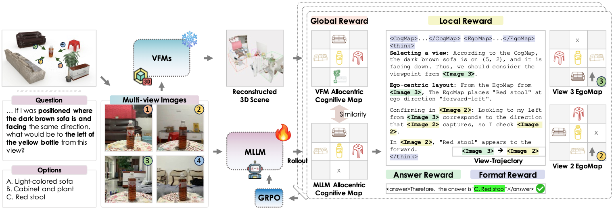

<h1 align="center">Dense Reward for Multi-View 3D Reasoning <br> with Global Maps and Local Views</h1>

<p align="center">
  
  <a href="https://dr-mv3d.github.io/"></a>
  <!--  -->
</p>

<p align="center">
  <a href="https://jihochoi.github.io/">Jiho Choi</a><sup>1 *</sup>,&nbsp;
  <a href="https://glanceyes.github.io/">Seonho Lee</a><sup>2 *</sup>,&nbsp;
  <a href="https://sjpark5800.github.io/">Seojeong Park</a><sup>1</sup>,&nbsp;
  <a href="https://kaist-cvml.github.io/index.html">Hyunjung Shim</a><sup>1 &dagger;</sup>
</p>

<p align="center">
  <sup>1</sup> KAIST&nbsp;
  <sup>2</sup> KRAFTON<br>
  <sup>*</sup> Equal contribution &nbsp; <sup>&dagger;</sup> Corresponding author
</p>

<div align="center">
    
</div>

<br>

This repository contains the official implementation of **DR-MV3D**, a map-grounded learning framework for multi-view 3D visual question answering (MV3D-VQA). Instead of sparse answer-level supervision, DR-MV3D supervises the reasoning process with dense, verifiable rewards: a global consistency reward that aligns predicted cognitive maps with geometry-consistent targets from frozen 3D vision foundation models, and a local trajectory reward that guides informative view selection. The full pipeline is optimized with trajectory-level policy optimization (GRPO).

## Updates

- 💻 **Code Release**: Coming soon 🚧

## Citation

```bibtex
@inproceedings{drmv3d2026,
  title={Dense Reward for Multi-View 3D Reasoning with Global Maps and Local Views},
  author={Choi, Jiho and Lee, Seonho and Park, Seojeong and Shim, Hyunjung},
  booktitle={Proceedings of the European Conference on Computer Vision (ECCV)},
  year={2026}
}
```
